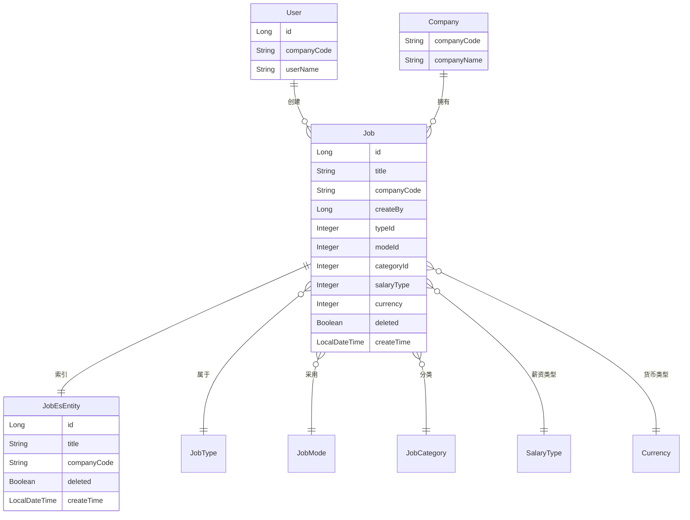

# 历史职位复用流程文档 (v2)

## 流程名称：历史职位复用

### 输入
- **用户身份**：已登录的HR用户（必填）
- **搜索关键字**：职位标题搜索关键字（字符串，可选）
- **分页参数**：页码和页大小（整数，必填，页大小最大20）
- **职位ID**：选中的历史职位ID（长整型，必填，用于获取详情）

### 处理逻辑

#### 1. 历史职位列表查询流程（支持去重）
1. **用户身份验证**
   - 使用UserContextUtil.getCurrentUserRecruitNeedLogin()获取登录信息
   - 获取用户的companyCode信息
   - 如果验证失败，返回认证错误

2. **参数验证**
   - 验证分页参数（pageIndex >= 1, pageSize >= 1 且 <= 20）
   - 搜索关键字可为空
   - 如果参数无效，返回参数错误

3. **ES搜索执行（含去重逻辑）**
   - 构建ES查询条件：
     - 必须条件：companyCode = 当前用户公司代码
     - 必须条件：deleted = false（未删除的职位）
     - 可选条件：title字段模糊匹配搜索关键字（使用wildcard查询）
   - 设置去重参数：使用collapse根据title字段去重
   - 设置排序：按id倒序排列（确保最新职位优先）
   - 设置分页参数
   - 添加cardinality聚合计算去重后的总数量
   - 执行ES搜索

4. **结果处理**
   - 提取搜索结果中的jobId和title字段
   - 从cardinality聚合中获取去重后的总数量
   - 构建分页响应对象
   - 返回职位列表

#### 2. 历史职位详情获取流程
1. **用户身份验证**
   - 使用UserContextUtil.getCurrentUserRecruitNeedLogin()获取登录信息
   - 获取用户的companyCode信息
   - 如果验证失败，返回认证错误

2. **职位权限验证**
   - 根据jobId查询职位信息
   - 验证职位的companyCode是否与当前用户匹配
   - 验证职位是否存在且未删除
   - 如果权限验证失败，返回权限错误

3. **详情数据获取**
   - 从数据库获取职位完整信息
   - 提取需求指定的字段：
     - jobTitle（职位标题）
     - modeId, modeName（工作模式）
     - typeId, typeName（职位类型）
     - jobDetail（职位详情）
     - mainDuty（主要职责）
     - minimumJobRequirement（最低要求）
     - preferredJobRequirement（优选要求）
     - skills（技能要求）
     - benefits（福利待遇）
     - salaryType, salaryTypeName（薪资类型）
     - currency, currencySimpleDesc（货币类型）
     - customQuestions（自定义问题）

4. **响应构建**
   - 构建职位详情响应对象
   - 返回完整的职位信息

### 输出

#### 历史职位列表接口响应
- **成功响应**：
  ```json
  {
    "currentPageRecords": [
      {
        "jobId": 123,
        "title": "软件工程师"
      },
      {
        "jobId": 124,
        "title": "产品经理"
      }
    ],
    "pageIndex": 1,
    "pageSize": 20,
    "totalCount": 15
  }
  ```
- **失败响应**：返回错误代码和错误信息

#### 历史职位详情接口响应
- **成功响应**：
  ```json
  {
    "jobTitle": "软件工程师",
    "modeId": 1,
    "modeName": "全职",
    "typeId": 2,
    "typeName": "技术类",
    "jobDetail": "负责系统开发和维护...",
    "mainDuty": ["编写高质量代码", "参与系统设计"],
    "minimumJobRequirement": ["本科学历", "3年以上经验"],
    "preferredJobRequirement": ["计算机相关专业", "有大型项目经验"],
    "skills": ["Java", "Spring Boot", "MySQL"],
    "benefits": ["五险一金", "弹性工作"],
    "salaryType": 4,
    "salaryTypeName": "按月",
    "currency": 1,
    "currencySimpleDesc": "USD",
    "customQuestions": ["你的职业规划是什么？"]
  }
  ```
- **失败响应**：返回错误代码和错误信息

### 异常处理
- **认证失败**：返回401未授权错误
- **权限不足**：返回403禁止访问错误
- **参数错误**：返回400参数错误，包含具体错误信息
- **职位不存在**：返回404资源不存在错误
- **ES搜索失败**：记录错误日志，返回500服务器内部错误
- **数据库连接失败**：重试3次，如仍失败则返回系统错误
- **去重处理异常**：降级为普通搜索，记录警告日志

### 实体关系

#### 主实体：Job（职位）
- **与User实体的关系**：多对一（多个职位属于一个用户创建）
  - 关系字段：Job表中的createBy字段关联User表的id字段
  - 约束条件：职位必须有有效的创建者
  - 业务规则：用户只能查看自己公司创建的职位
  - 功能体现：通过用户的companyCode过滤职位数据

- **与Company实体的关系**：多对一（多个职位属于一个公司）
  - 关系字段：Job表中的companyCode字段关联Company表的companyCode字段
  - 约束条件：职位必须属于有效的公司
  - 业务规则：
    - 职位数据按公司隔离
    - 用户只能访问自己公司的职位
    - 去重基于同一公司内的职位标题
  - 功能体现：
    - 历史职位搜索基于当前用户的companyCode进行过滤
    - 权限控制确保数据安全
    - 去重逻辑确保同一公司内相同标题的职位只显示一个

- **与JobEsEntity实体的关系**：一对一（每个职位在ES中有对应的索引记录）
  - 关系字段：Job表的id字段对应JobEsEntity的id字段
  - 约束条件：ES记录与数据库记录保持同步
  - 业务规则：
    - ES记录用于快速搜索和去重
    - 数据库记录作为权威数据源
    - 去重基于ES中的title字段
  - 功能体现：
    - 搜索功能使用ES的collapse功能提高性能
    - 去重功能使用ES的cardinality聚合计算准确总数
    - 详情获取从数据库确保数据准确性

#### 子实体关系
- **JobType（职位类型）**：Job.typeId -> JobType.id
- **JobMode（工作模式）**：Job.modeId -> JobMode.id  
- **JobCategory（职位类别）**：Job.categoryId -> JobCategory.id
- **SalaryType（薪资类型）**：Job.salaryType -> SalaryType.id
- **Currency（货币类型）**：Job.currency -> Currency.id

### 实体关系图



### 去重机制详解

#### ES去重实现
1. **Collapse字段去重**：
   - 使用ES的collapse功能根据title字段去重
   - 每个唯一的title只返回一条记录（按id倒序，返回最新的）
   - 语法：`.collapse(c -> c.field("title"))`

2. **总数计算**：
   - 使用cardinality聚合计算去重后的唯一title数量
   - 确保分页信息的准确性
   - 语法：`.aggregations("distinct_count", a -> a.cardinality(c -> c.field("title")))`

3. **排序策略**：
   - 按id倒序排列，确保最新创建的职位优先显示
   - 在去重的情况下，相同title的职位会选择id最大的（最新的）

#### 业务场景示例
假设公司有以下职位：
- id:100, title:"软件工程师", createTime:"2025-01-01"
- id:200, title:"软件工程师", createTime:"2025-02-01"  
- id:300, title:"产品经理", createTime:"2025-01-15"

去重后返回：
- id:200, title:"软件工程师"（最新的软件工程师职位）
- id:300, title:"产品经理"

### 安全考虑
1. **数据隔离**：严格按companyCode进行数据隔离
2. **权限验证**：每次请求都验证用户身份和数据权限
3. **输入验证**：对所有输入参数进行严格验证
4. **错误处理**：避免在错误信息中泄露敏感信息
5. **去重安全**：确保去重逻辑不会泄露其他公司的数据

### 性能优化
1. **ES搜索**：利用Elasticsearch提高搜索性能
2. **去重优化**：使用ES原生的collapse功能，性能优于应用层去重
3. **分页限制**：限制每页最大20条记录，避免大量数据传输
4. **字段选择**：列表接口只返回必要字段（jobId和title）
5. **索引优化**：确保companyCode、deleted、title字段有适当索引

### 扩展性考虑
1. **接口版本化**：支持API版本控制
2. **缓存策略**：可在后续版本中添加Redis缓存
3. **搜索增强**：可扩展支持更多搜索条件和去重字段
4. **批量操作**：可支持批量获取职位详情
5. **去重策略**：可配置化去重字段和策略

### 监控和日志
1. **访问日志**：记录所有API访问日志
2. **错误日志**：记录所有异常和错误信息
3. **性能监控**：监控ES搜索和去重操作的性能
4. **业务指标**：统计历史职位复用的使用情况和去重效果
5. **去重监控**：监控去重前后的数据量变化

### 技术实现要点

#### 1. ES查询示例（伪代码）
```java
SearchRequest.Builder searchRequest = new SearchRequest.Builder()
    .index("job_index")
    .query(q -> q.bool(b -> b
        .must(m -> m.term(t -> t.field("companyCode").value(companyCode)))
        .must(m -> m.term(t -> t.field("deleted").value(false)))
        .should(s -> s.wildcard(w -> w.field("title").value("*" + keyword + "*")))
    ))
    .collapse(c -> c.field("title"))  // 根据title去重
    .sort(sort -> sort.field(f -> f.field("id").order(SortOrder.Desc)))
    .from((pageIndex - 1) * pageSize)
    .size(pageSize)
    .aggregations("distinct_count", a -> a.cardinality(c -> c.field("title")));
```

#### 2. 接口设计
- **POST /job/history/list**：历史职位列表（支持去重和搜索）
- **GET /job/history/detail/{jobId}**：历史职位详情

#### 3. 数据传输对象
- **JobHistoryListRequestDTO**：包含搜索关键字和分页参数
- **JobHistoryDetailVO**：包含需求指定的所有字段
