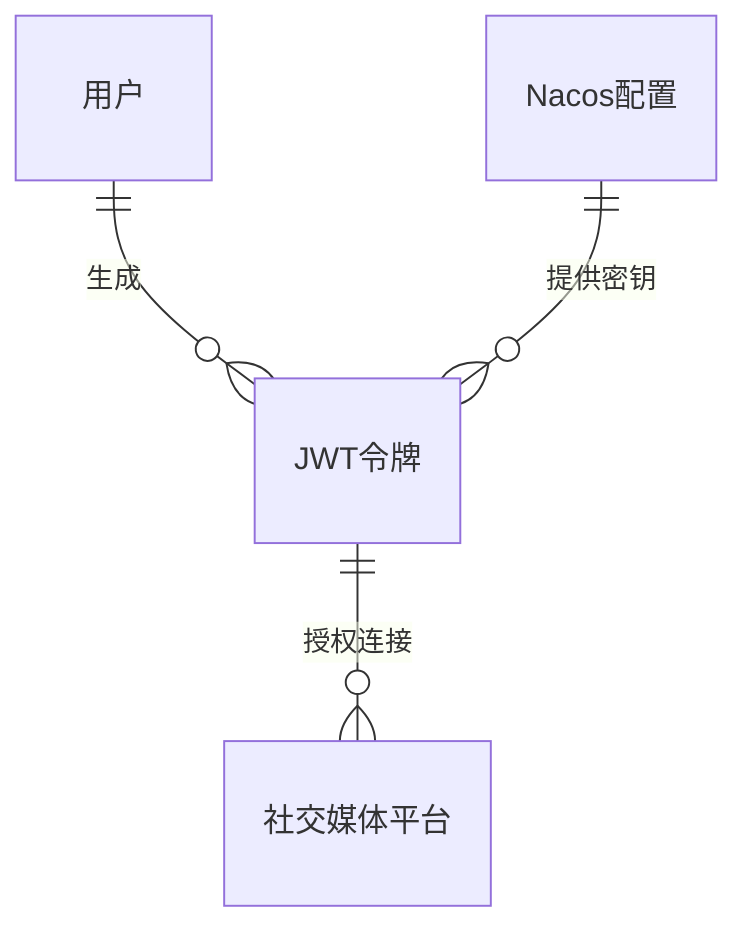

# AyrShare JWT Token 生成和平台信息获取流程文档

## 流程概述

本文档描述了招聘系统后端中AyrShare JWT Token生成和平台信息获取的详细流程，包括从Nacos配置中心获取配置、JWT生成、社交媒体平台信息获取等核心功能。

## 流程1：JWT生成流程

### 输入
- **无直接参数**：apiKey和privateKey从Nacos配置中心自动获取
- **userId**（长整型，系统自动获取）：当前登录用户ID
- **profileKey**（字符串，可选）：AyrShare Profile Key，可通过请求参数传入

### 处理逻辑
1. **用户身份验证**
   - 验证用户是否已登录
   - 检查用户权限（需要MASTER_USER或SUB_USER权限）
   - 如果验证失败，返回401未授权错误

2. **配置获取**
   - 从Nacos配置中心获取ayrshare.api.key
   - 从Nacos配置中心获取ayrshare.private.key
   - 验证配置是否存在且有效
   - 如果配置缺失，返回500配置错误

3. **JWT生成**
   - 使用项目现有的JwtUtils工具类
   - 创建JWT Claims，包含：
     - apiKey：从Nacos获取的AyrShare API密钥
     - privateKey：从Nacos获取的AyrShare私钥
     - userId：当前用户ID
     - profileKey：Profile Key（如果提供）
     - iat：签发时间
     - exp：过期时间（24小时）
   - 使用HS256算法签名

4. **生成授权链接**
   - 构建AyrShare授权URL
   - 格式：`https://app.ayrshare.com/generate-jwt?token={jwt_token}`
   - 返回完整的授权链接

5. **日志记录**
   - 记录JWT生成操作日志
   - 记录用户操作审计信息
   - 不记录敏感信息（privateKey）

### 输出
- **成功**：返回JWT授权链接和相关信息
  ```json
  {
    "success": true,
    "data": {
      "jwtToken": "eyJhbGciOiJIUzI1NiIsInR5cCI6IkpXVCJ9...",
      "authorizationUrl": "https://app.ayrshare.com/generate-jwt?token=...",
      "expiresAt": "2025-08-28T11:39:37Z",
      "profileKey": "optional_profile_key"
    },
    "message": "JWT generated successfully"
  }
  ```
- **失败**：返回错误代码和错误信息
  ```json
  {
    "success": false,
    "errorCode": "CONFIG_MISSING",
    "message": "AyrShare configuration not found in Nacos"
  }
  ```

### 异常处理
- **配置缺失**：返回500 Internal Server Error，提示Nacos配置缺失
- **用户未登录**：返回401 Unauthorized，提示用户需要登录
- **权限不足**：返回403 Forbidden，提示用户权限不足
- **JWT生成失败**：返回500 Internal Server Error，记录详细错误日志
- **Nacos连接失败**：重试3次，如仍失败则返回系统错误

### 实体关系
- **主实体**：AyrShare配置（Nacos）
  - 与用户实体的关系：多对一（多个用户可以访问同一个全局配置）
    - 关系字段：用户权限验证，无直接外键关系
    - 约束条件：用户必须有有效登录态和适当权限
  - 业务规则：
    - 配置信息全局共享，存储在Nacos配置中心
    - 所有有权限的用户共享同一套AyrShare配置
    - 配置的访问权限受用户角色限制
  - 功能体现：
    - JWT生成时需要验证用户权限
    - 配置信息动态从Nacos获取，支持热更新
    - 用户操作记录审计日志

- **关联实体**：用户
  - 提供用户身份验证和权限控制
  - 用于操作审计和日志记录

### 实体关系图


## 流程2：平台信息获取流程

### 输入
- **无直接参数**：apiKey从Nacos配置中心自动获取
- **userId**（长整型，系统自动获取）：当前登录用户ID

### 处理逻辑
1. **用户身份验证**
   - 验证用户是否已登录
   - 检查用户权限（需要MASTER_USER或SUB_USER权限）
   - 如果验证失败，返回401未授权错误

2. **配置获取**
   - 从Nacos配置中心获取ayrshare.api.key
   - 验证apiKey是否存在且有效
   - 如果配置缺失，返回500配置错误

3. **调用AyrShare API**
   - 构建HTTP请求头，包含Authorization: Bearer {apiKey}
   - 调用AyrShare Profile Details API
   - API端点：`https://app.ayrshare.com/api/profiles/profile`
   - 使用项目现有的HttpClient5Service
   - 设置30秒超时时间

4. **响应数据处理**
   - 解析AyrShare API响应
   - 提取用户配置信息：
     - activeSocialAccounts：活跃的社交账户列表
     - displayNames：显示名称信息
     - email：用户邮箱
     - monthlyApiCalls：本月API调用次数
     - monthlyPostCount：本月发布数量
     - lastApiCall：最后API调用时间
   - 转换为系统内部DTO格式

5. **数据缓存**（可选）
   - 将平台信息缓存到Redis
   - 设置缓存过期时间（1小时）
   - 减少对AyrShare API的频繁调用
   - 使用缓存键：`ayrshare:profile:{apiKey_hash}`

6. **审计日志**
   - 记录API调用操作
   - 记录响应状态和耗时
   - 记录用户操作审计信息

### 输出
- **成功**：返回平台信息详情
  ```json
  {
    "success": true,
    "data": {
      "activeSocialAccounts": ["facebook", "twitter", "linkedin"],
      "displayNames": [
        {
          "platform": "facebook",
          "displayName": "Company Name",
          "profileUrl": "https://www.facebook.com/...",
          "userImage": "https://img.ayrshare.com/...",
          "id": "104467885891838",
          "pageName": "Company Page"
        }
      ],
      "email": "user@example.com",
      "monthlyApiCalls": 44,
      "monthlyPostCount": 8,
      "lastApiCall": "2025-08-26T07:30:54Z",
      "refId": "492efe9b701be6a4e3780dc034468e1114da441a",
      "title": "Primary Profile"
    },
    "message": "Platform information retrieved successfully"
  }
  ```
- **失败**：返回错误代码和错误信息
  ```json
  {
    "success": false,
    "errorCode": "API_KEY_INVALID",
    "message": "API Key not valid. Please check Nacos configuration.",
    "details": "API Key received in header: xxx"
  }
  ```

### 异常处理
- **配置缺失**：返回500 Internal Server Error，提示Nacos配置缺失
- **API密钥无效**：返回400 Bad Request，提示API密钥无效
- **AyrShare API调用失败**：重试3次，记录错误日志，返回503 Service Unavailable
- **网络超时**：设置30秒超时，超时后返回504 Gateway Timeout
- **响应数据解析失败**：记录原始响应，返回500 Internal Server Error
- **缓存操作失败**：不影响主流程，记录警告日志

### 实体关系
- **主实体**：社交媒体平台信息
  - 与AyrShare配置的关系：多对一（多个平台信息属于一个AyrShare配置）
    - 关系字段：通过apiKey关联配置
    - 约束条件：平台信息必须通过有效的apiKey获取
  - 业务规则：
    - 平台信息实时从AyrShare API获取
    - 信息包含平台类型、显示名称、连接状态等
    - 支持多种社交媒体平台（Facebook、Twitter、LinkedIn等）
  - 功能体现：
    - 用户可以查看已连接的社交媒体平台
    - 平台信息用于发布内容时的平台选择
    - 统计信息帮助用户了解使用情况

- **关联实体**：Nacos配置
  - 提供API密钥用于平台信息获取
  - 确定平台信息的访问权限

## 技术实现细节

### Nacos配置类设计
```java
@Data
@RefreshScope
@Configuration
@ConfigurationProperties(prefix = "ayrshare")
public class AyrShareConfig {
    
    /**
     * AyrShare API Key
     */
    @Value("${ayrshare.api.key:}")
    private String apiKey;
    
    /**
     * AyrShare Private Key
     */
    @Value("${ayrshare.private.key:}")
    private String privateKey;
    
    /**
     * AyrShare API Base URL
     */
    @Value("${ayrshare.api.url:https://app.ayrshare.com/api}")
    private String apiUrl;
    
    /**
     * JWT授权URL
     */
    @Value("${ayrshare.jwt.auth.url:https://app.ayrshare.com/generate-jwt}")
    private String jwtAuthUrl;
}
```

### API接口设计
```java
@RestController
@RequestMapping("/api/v1/ayrshare")
@Auth(roleType = RoleType.MASTER_USER)
public class AyrShareTokenController {
    
    @PostMapping("/generate-jwt")
    public ResponseEntity<AyrShareJwtResponseVO> generateJwt(
        @RequestParam(required = false) String profileKey);
    
    @GetMapping("/profile-details")
    public ResponseEntity<AyrShareUserResDTO> getProfileDetails();
}
```

### 服务层设计
```java
@Service
@RefreshScope
@RequiredArgsConstructor
public class AyrShareTokenDomainService {
    
    private final AyrShareConfig ayrShareConfig;
    private final HttpClient5Service httpClient5Service;
    private final JwtUtils jwtUtils;
    private final StringRedisTemplate redisTemplate;
    
    public AyrShareJwtResponseDTO generateJwt(String profileKey);
    
    public AyrShareUserResDTO getProfileDetails();
    
    private void validateConfig();
    
    private String buildJwtAuthUrl(String jwtToken);
}
```

### 数据传输对象
- **AyrShareJwtResponseDTO**：JWT生成响应
- **AyrShareUserResDTO**：用户平台信息响应（已创建）
- **AyrShareCreatedInfoDTO**：创建时间信息（已创建）
- **AyrShareDisplayNameInfoDTO**：显示名称信息（已创建）

### 安全考虑
1. **敏感信息保护**
   - privateKey在Nacos中加密存储
   - API响应中不返回完整的privateKey
   - 日志中不记录敏感信息

2. **权限控制**
   - 使用@Auth注解进行权限验证
   - 仅MASTER_USER和SUB_USER可以访问
   - 记录详细的操作审计日志

3. **API安全**
   - 对外部API调用进行超时控制
   - 实现重试机制和熔断保护
   - 记录详细的审计日志

### 性能优化
1. **缓存策略**
   - 平台信息缓存1小时
   - 使用Redis进行分布式缓存
   - 缓存键包含apiKey哈希值

2. **配置热更新**
   - 使用@RefreshScope支持配置热更新
   - Nacos配置变更自动生效
   - 无需重启服务

3. **连接池优化**
   - 使用HttpClient5连接池
   - 设置合理的超时时间
   - 支持并发请求处理

## 错误码定义

### JWT生成相关错误码
- `AYRSHARE_CONFIG_MISSING`: AyrShare配置缺失
- `AYRSHARE_API_KEY_MISSING`: API Key配置缺失
- `AYRSHARE_PRIVATE_KEY_MISSING`: Private Key配置缺失
- `JWT_GENERATION_FAILED`: JWT生成失败

### 平台信息获取相关错误码
- `AYRSHARE_API_CALL_FAILED`: AyrShare API调用失败
- `AYRSHARE_API_TIMEOUT`: AyrShare API调用超时
- `AYRSHARE_API_KEY_INVALID`: API Key无效
- `AYRSHARE_RESPONSE_PARSE_ERROR`: 响应解析失败

## 监控和日志

### 关键指标监控
- JWT生成成功率和响应时间
- AyrShare API调用成功率和响应时间
- Nacos配置获取成功率
- 缓存命中率

### 日志记录
- 用户操作日志（JWT生成、平台信息获取）
- API调用日志（请求参数、响应时间、错误信息）
- 配置获取日志（Nacos配置变更、获取失败）
- 安全事件日志（权限验证失败、异常访问）

### 告警机制
- AyrShare API调用失败率超过阈值
- JWT生成失败率超过阈值
- Nacos配置获取失败
- 缓存服务异常

## 部署和配置

### Nacos配置示例
```yaml
ayrshare:
  api:
    key: "your_ayrshare_api_key"
    url: "https://app.ayrshare.com/api"
  private:
    key: "your_ayrshare_private_key"
  jwt:
    auth:
      url: "https://app.ayrshare.com/generate-jwt"
```

### 环境变量配置
- `AYRSHARE_API_KEY`: AyrShare API密钥
- `AYRSHARE_PRIVATE_KEY`: AyrShare私钥
- `AYRSHARE_API_URL`: AyrShare API基础URL

---

**文档版本**：1.0  
**创建时间**：2025-08-27 11:39:37  
**创建者**：hua.liu  
**最后更新**：2025-08-27 11:39:37
